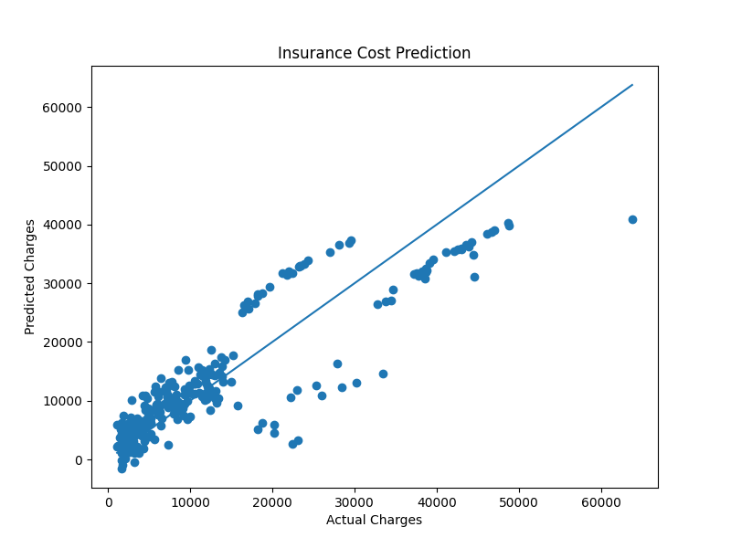

# Medical Insurance Price Prediction Using Linear Regression

A Machine Learning project that predicts medical insurance charges using Linear Regression. The project includes data preprocessing, feature encoding, model training, prediction, model persistence, and visualization of actual versus predicted insurance costs.

---

## Project Overview

Medical insurance companies estimate insurance charges based on factors such as age, BMI, smoking habits, number of children, gender, and residential region.

This project uses a Linear Regression model to learn patterns from historical insurance data and predict the expected medical insurance charges for new customers.

---

## Features

- Data preprocessing and cleaning
- Encoding categorical variables
- Train-Test Split
- Linear Regression model training
- Model evaluation using R² Score
- Insurance cost prediction
- Model persistence using Pickle
- Data visualization using Matplotlib
- Menu-driven project execution

---

## Dataset

The dataset contains information about individuals and their medical insurance charges.

### Attributes

| Feature | Description |
|----------|-------------|
| age | Age of the individual |
| sex | Gender (Male/Female) |
| bmi | Body Mass Index |
| children | Number of dependent children |
| smoker | Smoking status |
| region | Residential region |
| charges | Medical insurance charges (Target Variable) |

### Dataset Information

- Records: 1338
- Features: 6
- Target Variable: charges

---

## Dataset Source

This project uses the Medical Insurance Dataset, which contains demographic and health-related information used to predict insurance charges.

Dataset CSV:

https://raw.githubusercontent.com/stedy/Machine-Learning-with-R-datasets/master/insurance.csv

---

## Technologies Used

- Python
- Pandas
- NumPy
- Scikit-Learn
- Matplotlib
- Pickle

---

## Project Structure

```text
Medical-Insurance-Price-Prediction-Using-Linear-Regression/
│
├── dataset/
│   └── insurance.csv
│
├── src/
│   ├── train_model.py
│   ├── predict.py
│   └── visualization.py
│
├── models/
│   └── insurance_model.pkl
│
├── results/
│   └── actual_vs_predicted.png
│
├── requirements.txt
├── main.py
└── README.md
```

---

## Machine Learning Workflow

```text
Dataset
   ↓
Data Preprocessing
   ↓
Encoding
   ↓
Train-Test Split
   ↓
Linear Regression Model
   ↓
Model Evaluation
   ↓
Prediction
   ↓
Visualization
```

---

## Model Performance

### Evaluation Metric

- R² Score: 0.7836

This indicates that the model explains approximately 78.36% of the variation in medical insurance charges.

---

## How to Run

### Train the Model

```bash
python src/train_model.py
```

### Predict Insurance Charges

```bash
python src/predict.py
```

### Generate Visualization

```bash
python src/visualization.py
```

### Run Menu-Based Application

```bash
python main.py
```

---

## Sample Prediction

### Input

```text
Age: 30
Sex: male
BMI: 26
Children: 1
Smoker: no
```

### Output

```text
Predicted Insurance Cost = ₹ 4949.15
```

---

## Visualization

The project generates a scatter plot comparing actual and predicted insurance charges.

Generated Output:

```text
results/actual_vs_predicted.png
```

You can also add the generated graph screenshot below:

```md

```

---

## Future Enhancements

- Flask-based Web Application
- Interactive Dashboard
- Comparison of Multiple Regression Models
- Hyperparameter Optimization
- Cloud Deployment
- Insurance Risk Classification

---
